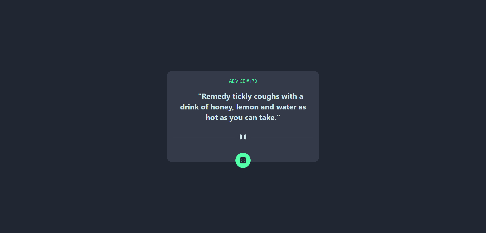
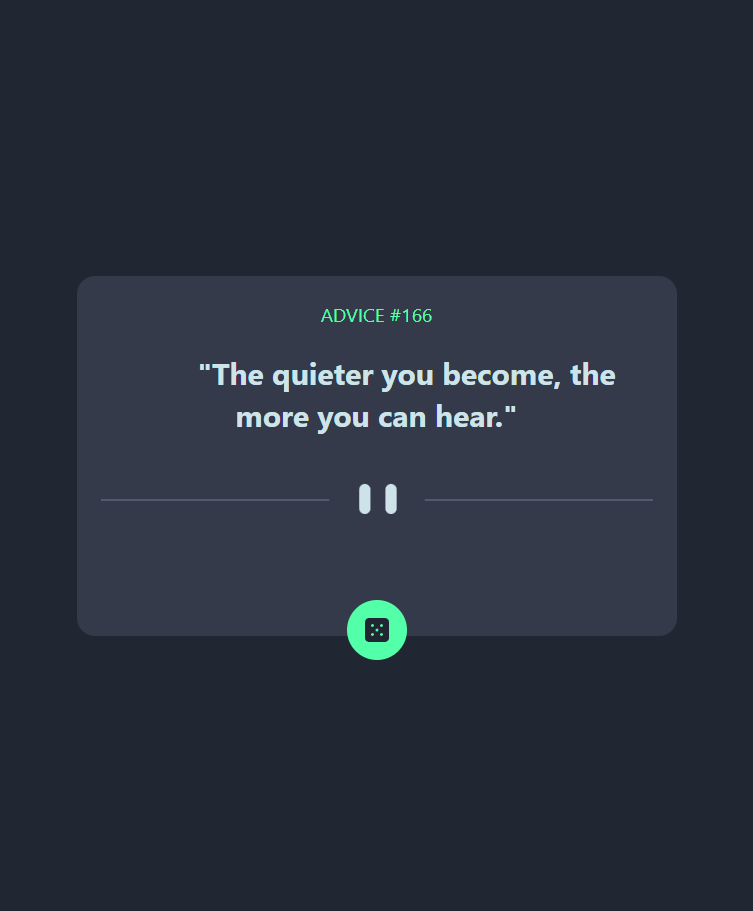
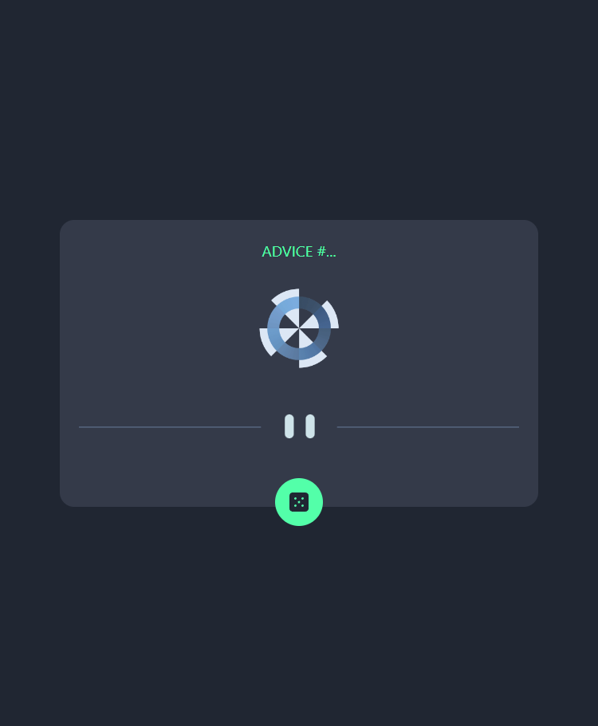

# Frontend Mentor - Advice Generator App

## Table of contents

- [Overview](#overview)
- [The challenge](#the-challenge)
- [Screenshot](#screenshot)
- [Links](#links)
- [My process](#my-process)
- [Built with](#built-with)
- [What I learned](#what-i-learned)
- [Useful resources](#useful-resources)
- [Author](#author)

## Overview

This is an advice generator app. It generates a random advice each time the dice button is clicked. It was built with React.js, JSX, JavaScript, tailwindCSS and the AdviceSlip API.

### The challenge

Users should be able to:
- Generate new advice when they click the dice button
- See the size of the elements adjust based on their device's screen size

### Screenshot

### Links

- Solution URL: https://github.com/tomjames156/advice-generator)
- Live Site URL: https://calulator-app.netlify.app/)

## My process

- I initialized the React App and added the tailwind dependencies for the app. 
- I made use of tailwindCSS for the styling of the app.
- I added the structure of the web app using JSX (JavasScript XML)
- I added the logic using JavaScript

### Built with

- JavaScript XML
- TailwindCSS classes
- Flexbox
- Desktop-first workflow

### What I learned

I learnt about the Context API and made use of it to store all the app's state like the generated advice. I also learnt about tailwindCSS classes which I used to create the styling of the app.

### Useful resources

(https://www.udemy.com/course/react-front-to-back-2022/?referralCode=4A622C7E48DB66154114)
(https://github.com/bradtraversy)

## Author

- Website - [Akinwande Tomisin](https://tomis-portfolio.netlify.app)
- Github - [@tomjames156](https://github.com/tomjames156)
- Frontend Mentor - [@tomjames156](https://www.frontendmentor.io/profile/tomjames156)
- Twitter - [@tomisnakinwande](https://mobile.twitter.com/tomisnakinwande/)